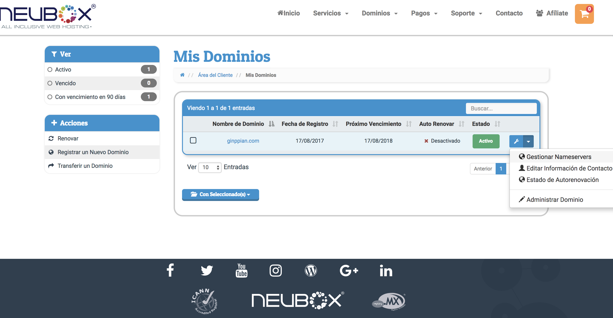
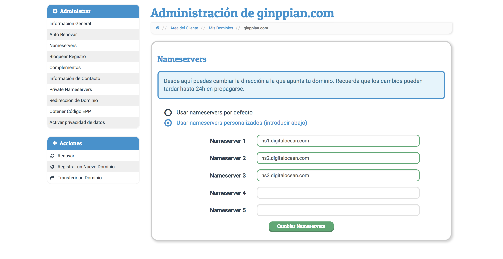
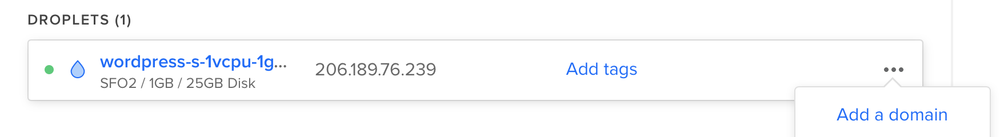
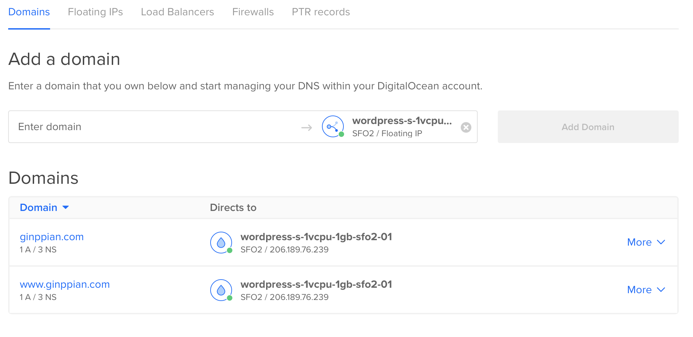
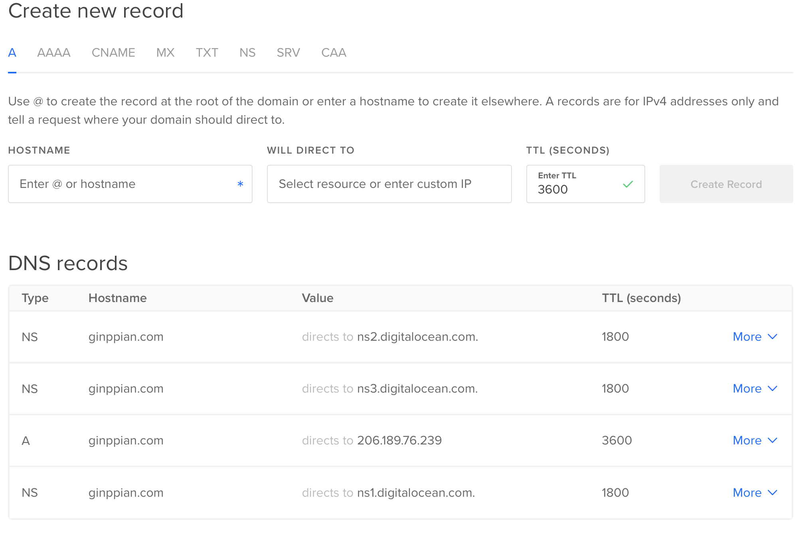

Agregar un Dominio al Droplet en Digital Ocean
===

## Definición

Para poder acceder a nuestro servidor desde el navegador sin necesidad de usar la ip es necesario comprar un dominio y asignarlo.

### Paso 1 - Comprar Dominio

En nuestro caso compramos un dominio en <a href="https://neubox.com/">newubox</a> 

  Asociar los nameserver a la página de dominios

### Paso 2 - Asignar los *nameservers* a nuestra página donde compramos el dominio

En este caso los de *digitalOcean* que son siempre los mismos.

<p align="center">
	
</p>

<p align="center">
	
</p>

```
ns1.digitalocean.com
ns2.digitalocean.com
ns3.digitalocean.com
```

Nota: Los *nameServers* algunas páginas aceptan que termine con punto, en nuestro caso va sin punto.

### Paso 3 - Asignar el nombre de dominio a nuestro droplet

<p align="center">
	
</p>

<p align="center">
	
</p>

### Paso 4 - Esperar

Pudiera que se tarde nuestra página de dominios hasta 48hrs en asociar nuestros *nameservers* si ya estan registrados y actualizamos el nombre de dominio es posible que tarde unos minutos.

Nota: En caso de querer corroborar los *nameServers* podemos entrar a <a href="http://digitalocen.com/">digitalOcean</a> <br>
nuestro droplet > add domain > more > manage domain > DNS Records

<p align="center">
	
</p>

Nota: Si nuestro dominio ya está asociado a otra cuenta de DigitalOcean no nos dejará asociarlo a nuestro nuevo droplet, es necesario acceder a nuestra anterior cuenta y desasociar el nombre de dominio.
